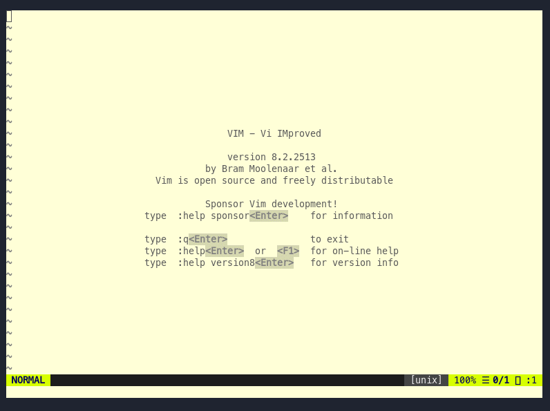

# Linny.vim

Personal wiki and document database powered by Markdown and Front Matter.



# Quickstart

[Read the Linny.vim + Carl quick start tutorial](https://linden-project.github.io/posts/tutorial-linny-and-carl/)

# Installation

Use your favorite package manager.

Using vim-plug:

```
Plug 'linden-project/linny.vim'
```

## Install fred

Some features for linny require [fred](https://github.com/linden-project/fred).

Install the latest version on your system. Linny will show the version in the
linny menu.

# Documentation

The official manual can be read directly in Vim:

```
:help linny
```

Alternatively, you can read
[linny.txt](https://github.com/linden-project/linny.vim/blob/master/doc/linny.txt)
in your browser.

# Credits

- [vimwiki](https://github.com/vimwiki/vimwiki) - The most popular Wiki plugin for Vim
- [mmai/vim-markdown-wiki](https://github.com/mmai/vim-markdown-wiki) - A simple Wiki plugin for vim made with a few Markdown additions
- [Kiwi](https://github.com/landakram/kiwi) - An iOS Wiki App using dropbox for synchronization and Markdown as wiki documents.
- [skywind3000/quickmenu](https://github.com/skywind3000/quickmenu.vim) - Side panel menu plugin with customizable shortcuts.

# License

MIT - Copyright 2019-2023 (c) Pim Snel.
